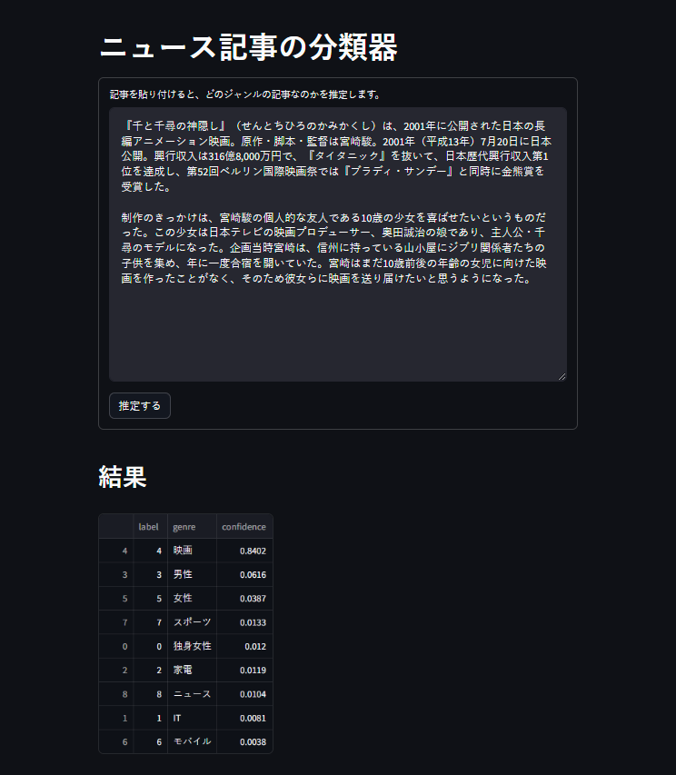

# livedoor-news-dataset

[Livedoor ニュースコーパス] を使ったニュース記事の分類器です。



## 必要なもの

- Python3
- [Vibrato](https://github.com/daac-tools/vibrato)（辞書のみ）

## 準備

```shell
$ python3 -m pip install -r requirements.txt
```

## データセットのダウンロード

データセットをダウンロードし、形態素解析を行います。

```shell
$ python3 download.py
```

## モデルの作成

コーパスを使ってディープラーニングでモデルを作成します。

```shell
$ python3 train.py
```

## 分類器を試す

Web ページを開きます。

```shell
$ streamlit run app.py
```

http://localhost:8501 にアクセスすると Web ページが表示されますので、適当な文章を入力して下さい。下部に判定結果がグラフで表示されます。

[Livedoor ニュースコーパス]: http://www.rondhuit.com/download.html#ldcc
